# Mutual Fund Tracking App

This is a simple mutual fund tracking app that allows users to track their mutual fund investments. The app is built using Python and Streamlit. The app allows users to add their mutual fund investments and track their performance over time. The app also provides visualizations to help users understand how their investments are performing. We are using the [mfapi](https://www.mfapi.in/) to get the NAV data of the mutual funds.

## Why the App?

Mutual funds are a popular investment option for many people. However, tracking the performance of mutual fund investments can be challenging as most of the apps that provide option to buy/sell mutual fund do not have a very good tracking system. For example, in Coin, the best we can get is the current value of our investment and how much delta there is between today and the last trading day (and even for this, we will need to click on each mutual fund seperately). Groww is a little better using this we can at least see the delta for all the mutual funds in one place in a single glance. But still, we can not answer simple questions like by how many percentage our portfolio (or individual funds) have moved during a given time period. This app aims to solve this problem by providing a simple and easy-to-use interface to track mutual fund investments with multiple tabs visualizations.

## How to Run the App?

### Clone the Repository

The first thing we need to do is to clone the repository to local machine. We can do this by running the following command in the terminal:

```bash
git clone https://github.com/Hari31416/investment_tracker_app.git
```

### Creating MongoDB Database

Note that this is a web app and is dependant on having a mongoDB database. We can create a free mongoDB database by following the instructions [here](https://www.mongodb.com/resources/products/fundamentals/create-database). Once we have created the database, we will need to create some environment variables to connect to the database. We can do this by creating a `.env` file in the root directory of the project. Have a look at the `.env.default` file to see what environment variables we need to create.

### Collections Required

The app requires three collections in the database. The first collection is `users` which will store the user information. The second collection is `transcations` which will store the mutual fund transcations. The third is a mapping collection `mapping` that will store the mapping between ISIN code and `scheme_code` used in the [mfapi](https://www.mfapi.in/).

#### `users` Collection

The barebone schema for the `users` collection is as follows:

```json
{
  "cookie": {
    "expiry_days": 7,
    "key": "must_have_key",
    "name": "have_a_cookie"
  },
  "credentials": {
    "usernames": {}
  },
  "pre-authorized": { "emails": [] }
}
```

The `credentials` field will store the username and password and other informations like name and email address. We do not need to fill them. Once we register a new user, the app will automatically fill this information. The `pre-authorized` field will store the email addresses of the users who are pre-authorized to use the app. The `cookie` field will store the cookie information.

> Have a look at [Streamlit-Authenticator](https://github.com/mkhorasani/Streamlit-Authenticator) to understand the schema of the `users` collection.

#### `transactions` Collection

This database contains the transcations of the mutual funds. The schema for the `transactions` collection is as follows:

```json
{
  "username": "sample",
  "transactions": [
    {
      "scheme_code": 119091,
      "isin": "INF179KB1HP9",
      "purchase_history": [
        {
          "units": 4.288,
          "average_nav": 4664.2362,
          "purchase_date": "2024-01-08"
        }
      ],
      "sale_history": [
        {
          "units": 4.288,
          "average_nav": 4718.7537,
          "sale_date": "2024-03-06"
        }
      ]
    },
    {
      "scheme_code": 120821,
      "isin": "INF966L01580",
      "purchase_history": [
        {
          "units": 87.688,
          "average_nav": 114.0344,
          "purchase_date": "2024-01-08"
        },
        {
          "units": 340.261,
          "average_nav": 117.5509,
          "purchase_date": "2024-01-15"
        },
        {
          "units": 91.896,
          "average_nav": 136.0162,
          "purchase_date": "2024-05-15"
        }
      ],
      "sale_history": []
    }
  ]
}
```

Again, we do not need to create/update the `transactions` collection manually. The app will automatically update this collection using the tradebook we provide.

#### `mapping` Collection

The `mapping` collection will be used to save any other information related to mutual fund. For now, we only have a single object with name `isin_to_scheme_code` that maps the `scheme_code` to the `isin` code. The schema for the `mapping` collection is as follows:

```json
{
  "isin_to_scheme_code": [
    {
      "symbol": "HDFC LIQUID FUND - DIRECT PLAN",
      "isin": "INF179KB1HP9",
      "scheme_code": 119091,
      "short_name": "HDFC LIQUID"
    },
    {
      "symbol": "QUANT MULTI ASSET FUND - DIRECT PLAN",
      "isin": "INF966L01580",
      "scheme_code": 120821,
      "short_name": "QUANT MULTI ASSET"
    }
  ]
}
```

The `short_name` and `symbol` are used to display the mutual fund name in the app. This mapping file must have a mapping for all of the mutual funds that we have in our tradebook.

### The Environment Variables

The following environment variables are required to run the app:

```bash
MONGO_USER=<username>
MONGO_PASSWORD=<password>
MONGO_HOST=<host>
MONGO_DB=<database> # The name of the database where the collections are stored
MONGO_USER_COLLECTION=users # The name of the collection where the user information is stored
MONGO_MAPPING_COLLECTION=mappings # The name of the collection where the mapping information is stored
MONGO_TRANSACTIONS_COLLECTION=transactions # The name of the collection where the transactions are stored
```

### Running the app

Once the database and environment variables are set up, we can run the app by running the following command in the terminal:

```bash
streamlit run app.py
```

This will start the app and open a new tab in the default browser. We can now start using the app to track our mutual fund investments.

## Features

An overview of the features supported by the app are:

1. **Add New User**: We can register new users and create a new account. The user can provide their name, email address, and password to create a new account.
2. **Login**: Next, the user can log in to the app using their email address and password.
3. **Update Password**: The user can update their password by providing their old password and new password.
4. **Update Transcations Using Tradebook**: The transcations can be updated using the tradebook downloaded from Zerodha. If other broker is used, make sure that the tradebook has the following columns:
   `["symbol", "isin", "trade_date", "trade_type", "quantity", "price"]`

### Login Related Features

The first time that the app is opened, the login page will be displayed.

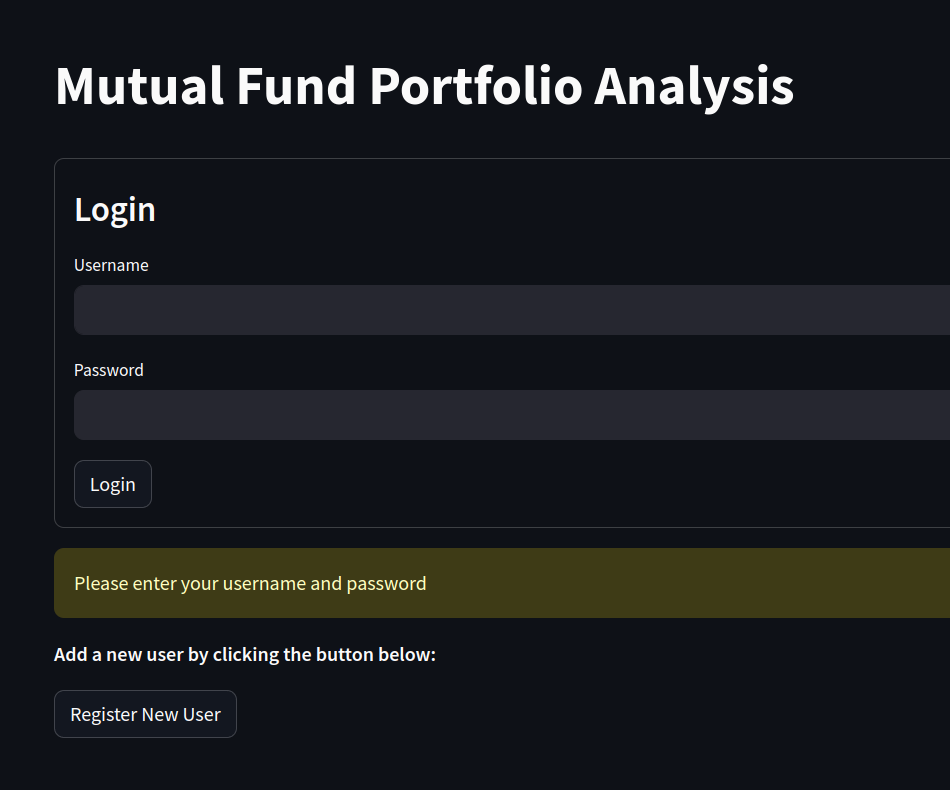

One can either login using the email and password or register a new user by clicking on the `Register New User` button. This will open a modal where the user can provide their name, email address, and password to create a new account.

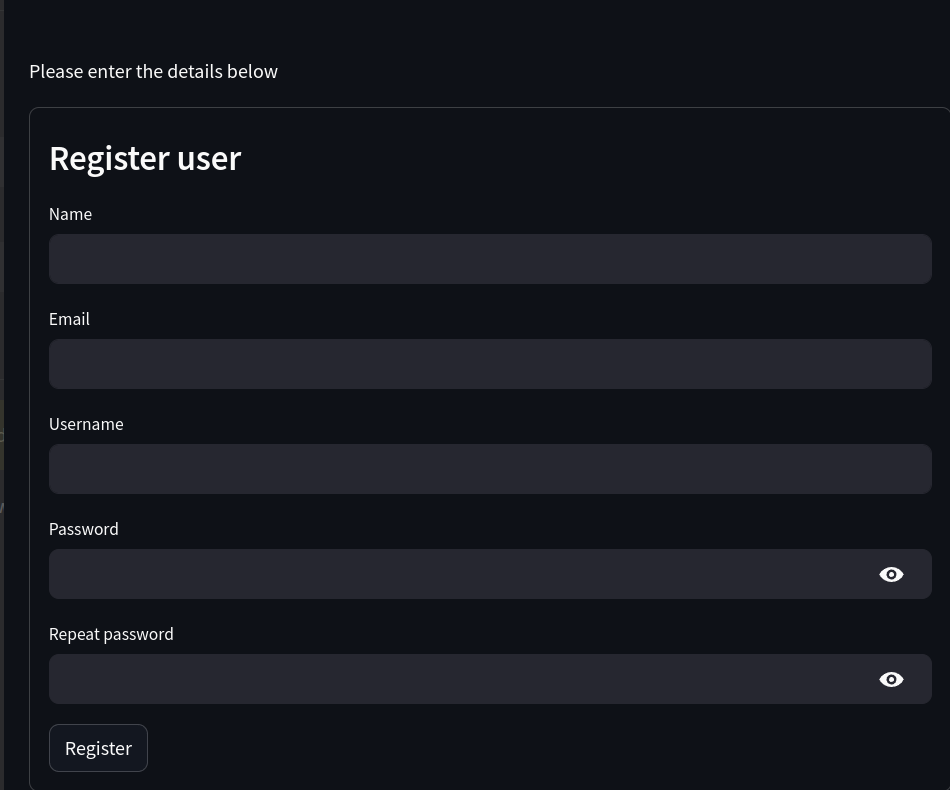

Once logged in, the dashboards will be displayed.

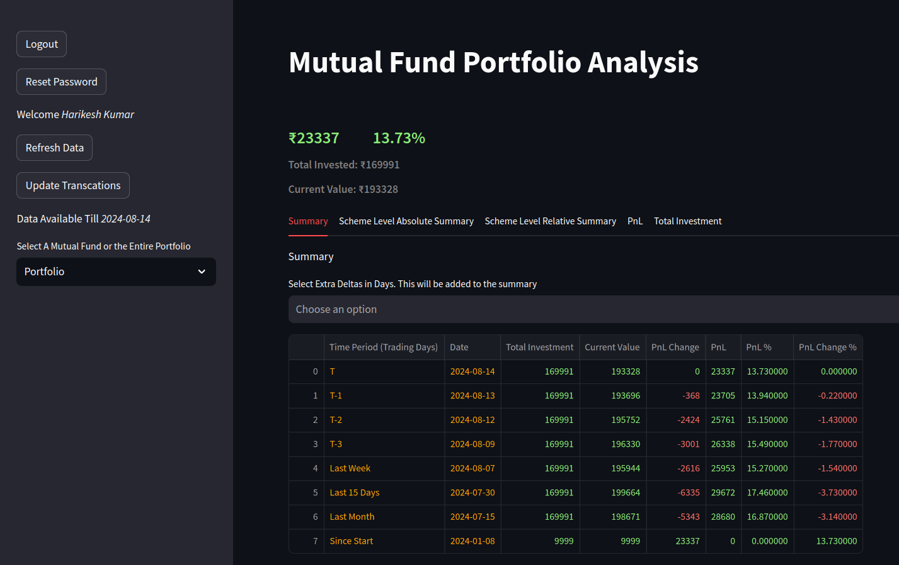

On the left, we have a sidebar with buttons to navigate to different pages. The dashboard page displays the user's name and buttons to logout or reset password. The sidebar also displays the last date the data was updated.

One can use the `Update Password` button to update their password. This will open a modal where the user can provide their old password and new password.

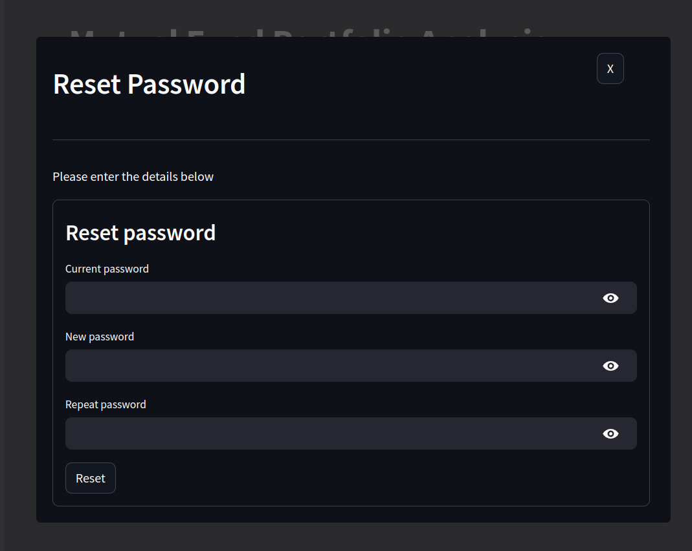

### Update Transcations Using Tradebook

To update the transcations, we need to click on the `Update Transcations` button in the sidebar. This will open a modal where the user can upload the tradebook.

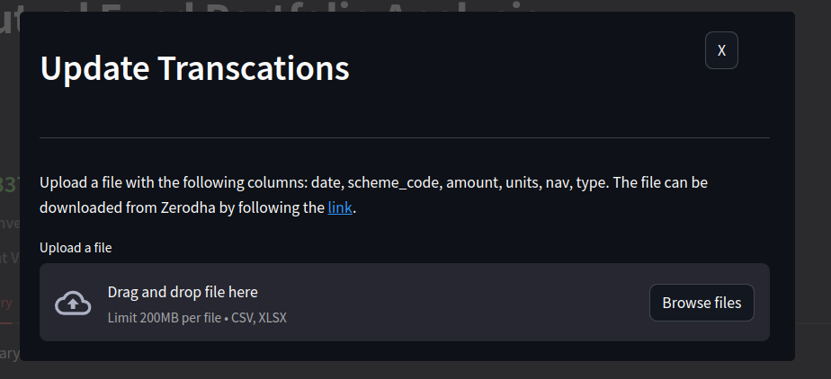

## Dashboards and Tables

Here is a view of the dashboards and tables that are available in the app:


The dashboards are built on two levels and are arranged as tabs. The two levels are:

1. The Whole Portfolio Level
2. The Individual Mutual Fund Level

We can choose the level by choosing the dropdown in the sidebar.

### Common Tabs

The whole portfolio level displays the performance of the entire portfolio over time. The overall summary, that remains the same in both levels, is displayed at the top of the page. This shows your total investment, total current value, total profit/loss, and the profit/loss percentage.

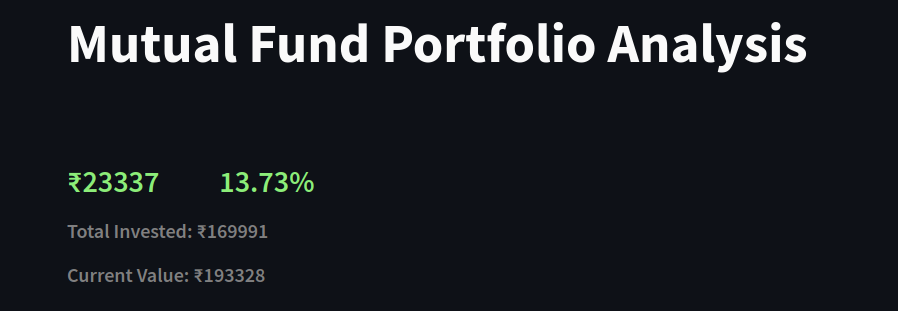

The following tabs are available at the whole portfolio level as well as the individual mutual fund level:

<!-- 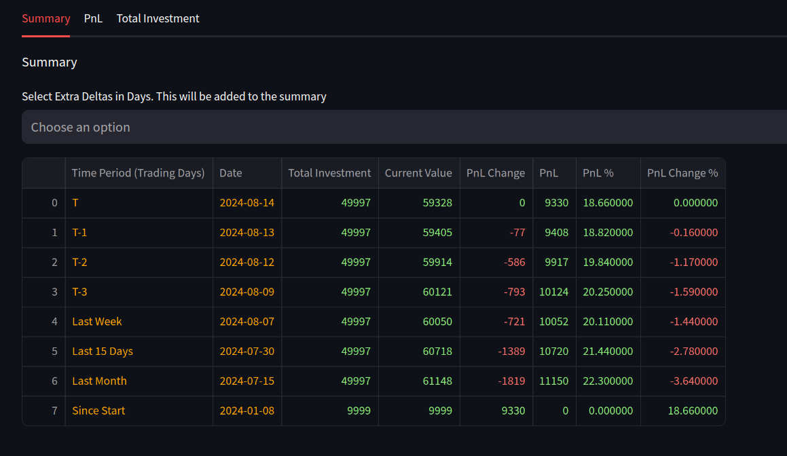 -->

> We can change the level by clicking on the dropdown in the sidebar.
> 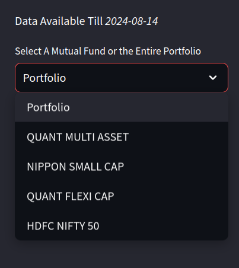

#### Summary Tab

The summary tab displays the summary of the portfolio/mutual fund. The summary includes the comparison total investment, total current value, total profit/loss, and the profit/loss percentage with a number of past dates. We can even add any date we like.

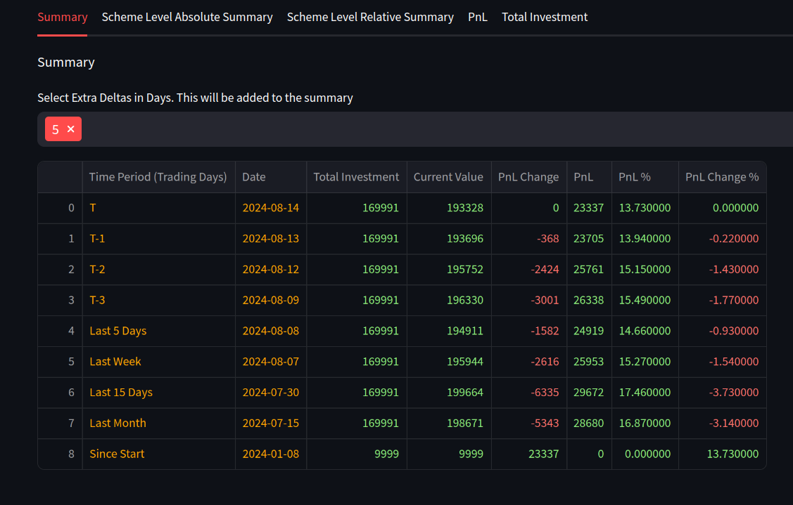

#### PnL Tab

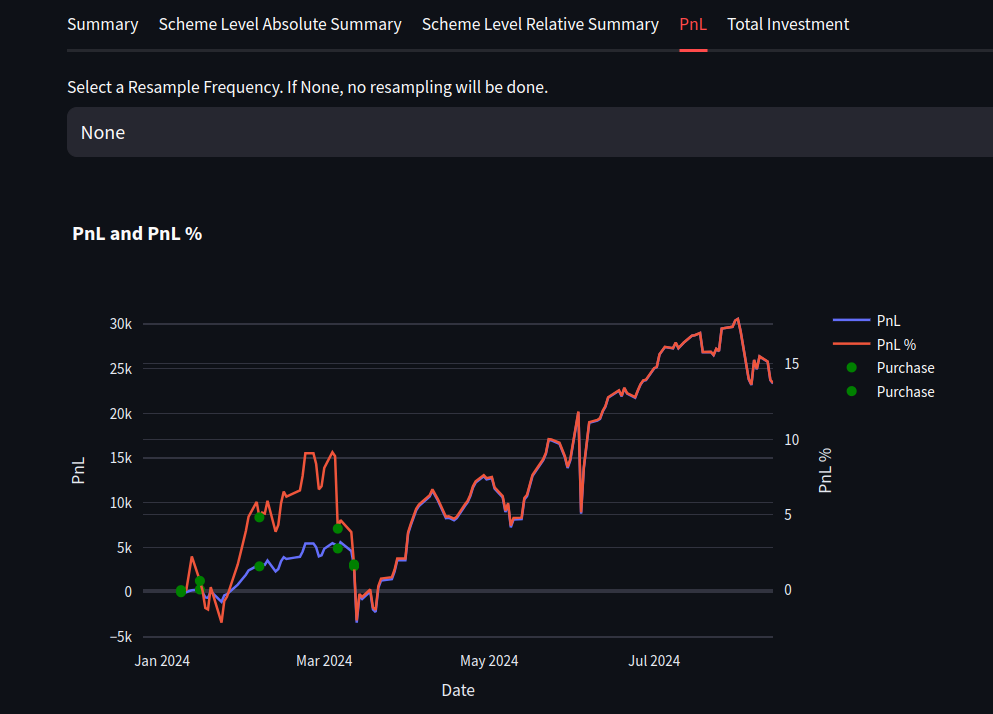

This is a time series plot with two lines. The first line is the total PnL in numbers and the second line is the total PnL in percentage (of the whole portfolio or the selected mutual fund). The x-axis is the date and the y-axis is the PnL. All the plots are created using Plotly and hence are interactive.

By default, the PnL is on daily level but we can change it to weekly, monthly, or yearly level by clicking on the dropdown. For example, the following figure shows that same PnL plot but on weekly level.

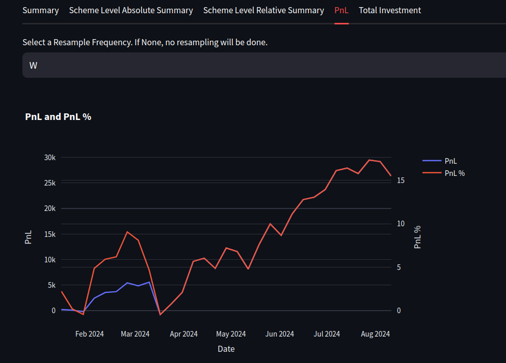

#### Investment Tab

This tab displays the total investment and the current value of the portfolio/mutual fund over time. The x-axis is the date and the y-axis is the amount. This plot can be used to see how the investment has grown over time. Similar to the PnL tab, we can change the level of the plot by clicking on the dropdown.

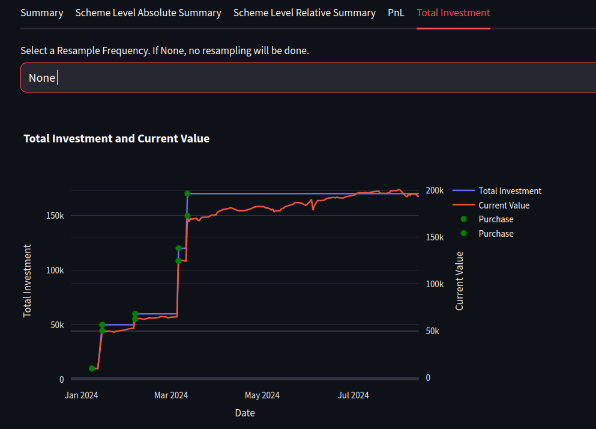

### Tabs at the Whole Portfolio Level

There are two other tabs that are available at the whole portfolio level.

#### Scheme Level Absolute Summary

This is basically a pivot where the rows are the different mutual funds in the portfolio, the columns are the different dates, and the values are the PnL percentage/number. The following figure shows the scheme level absolute summary for the whole portfolio.

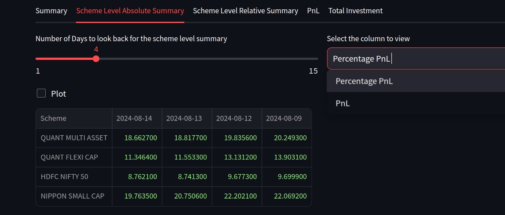

By deafult, the summary is shown as table with the last 3 days. We can change the number of days by clicking on the dropdown. We can also change the view a line chart by clicking on the `Plot` radio button.

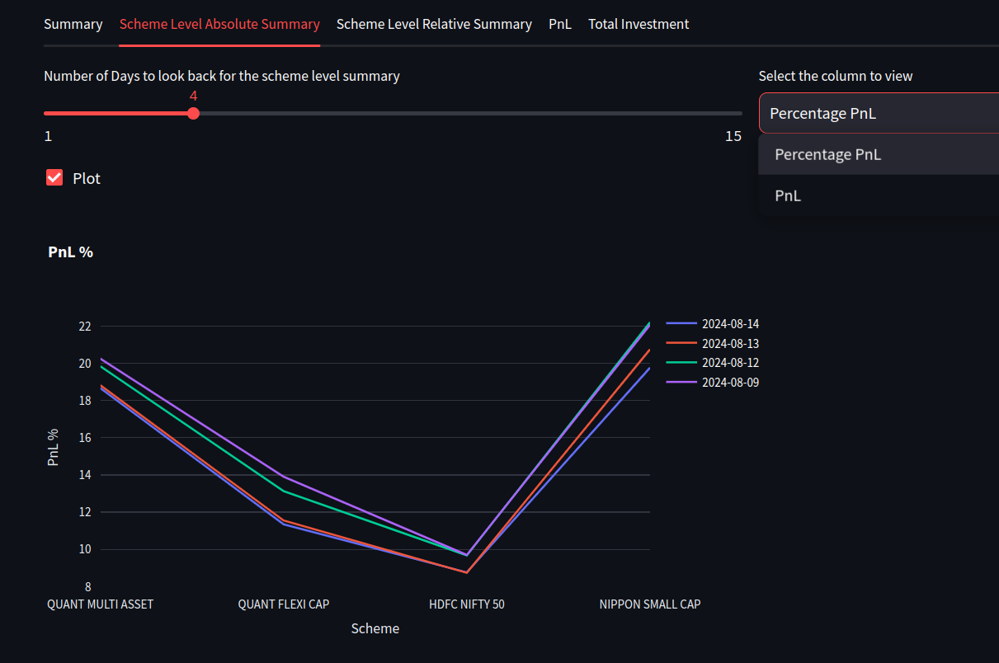

#### Scheme Level Relative Summary

This is similar to the scheme level absolute summary but the values are the PnL percentage/number relative to a provided date.

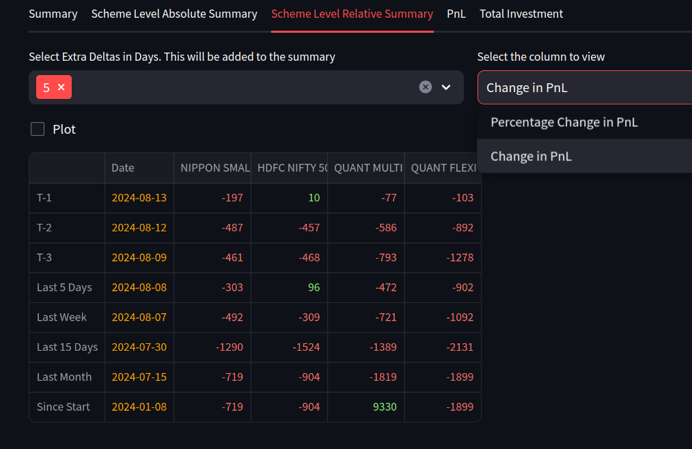
